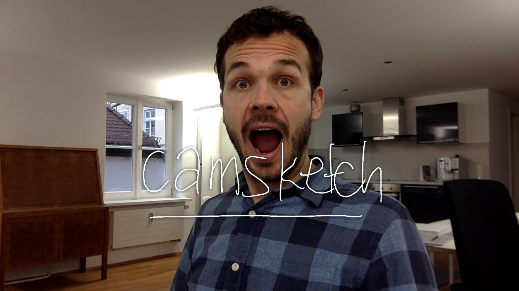
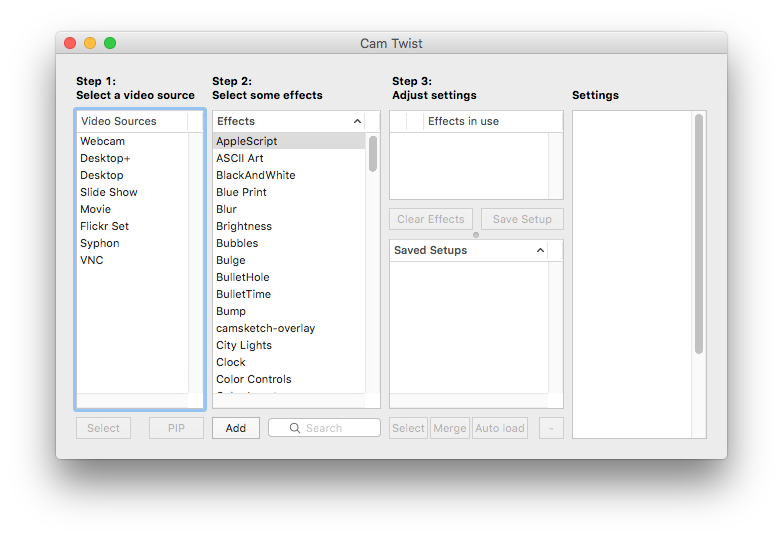
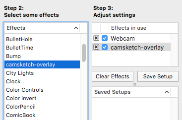
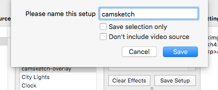
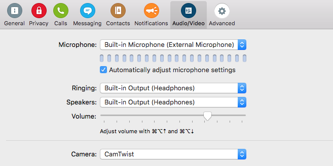

# camsketch

Sketch on a tablet, and have the image overlayed on a video stream.
Inspired by Ishii and Kobayashi's [ClearBoard](http://tangible.media.mit.edu/project/clearboard/).

## Prerequisities

- [CamTwist](http://camtwiststudio.com/download/) (tested with version 3.0)
    - Version 3.0 works with OS X El Capitan (10.11.1)
- [Node.js](https://nodejs.org/en/) (tested with version 4.4.2)

## Installation

- Clone this repository:

        git clone https://github.com/pdubroy/camsketch

- Run `npm install` from the repository root:

        cd camsketch
        npm install

- Open CamTwist. You should see the following window:

  

  If this window does not appear, select View -> Main Window from the CamTwist
  menu.

- Double-click "Webcam" under "Step 1"

- In the "Step 2" column, find "camsketch-overlay" and double-click it.

  

- Click the "Save Setup" button and give this setup a name, e.g. "camsketch".
  Uncheck "Don't include video source" and click "Save":

  

- (Optional) Click the "Auto load" button to make CamTwist automatically load
  this setup as soon you open the app.

## Usage

- Make sure CamTwist is running and the setup you created during installation
  is active.

- From the root of the camsketch repository, run `npm start`.

- From your iPad, visit the "External" URL that's listed in the console.

- In Skype/Hangouts/etc., make sure to set "CamTwist" as your camera source:

  

- Sketch on your iPad, and the image will be overlayed on your video stream.
