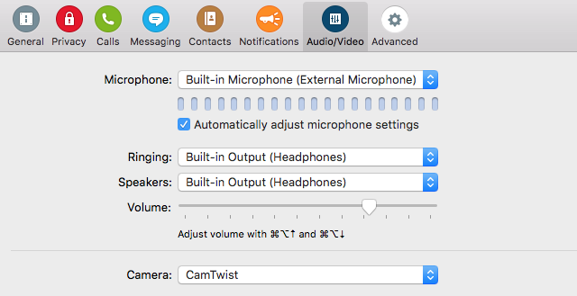

# Camsketch

Sketch on a tablet, and have the image overlayed on a video stream.
Inspired by Ishii and Kobayashi's [ClearBoard](http://tangible.media.mit.edu/project/clearboard/).

## Prerequisities

- Install CamTwist. [Version 3.0](http://camtwiststudio.com/beta/CamTwist_3.0.dmg)
  is recommended -- it **does** in fact work with OS X 10.11.1 (El Capitan).

## Installation

1. Clone this repository:

        git clone https://github.com/pdubroy/camsketch

2. Run the installation script:

        cd camsketch
        bin/install.command

  (You can also run it by double-clicking the file in Finder.)

## Usage

1. In Skype/Hangouts/etc., make sure "CamTwist" is set as your camera source:

   

2. From the root directory of your Camsketch checkout, run the server script:

        python src/server/server.py

   This will launch CamTwist, and start a local web server which will be
   accessible on your local network:

   

3. On your tablet, open the URL that was displayed in the previous step.

4. Sketch on your tablet, and the image will be overlayed on your video stream.
