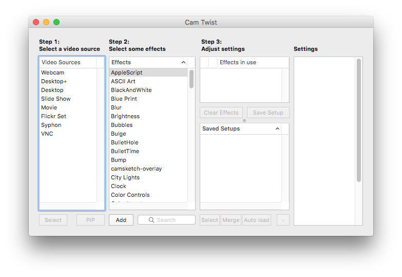
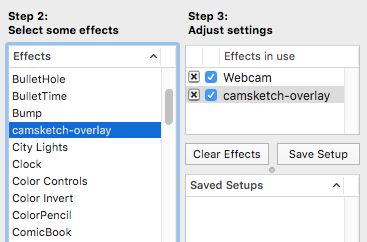

# Manual CamTwist Setup

CamTwist _should_ be set up automatically the Camsketch installation script.
If that didn't work, here's how to set up CamTwist manually:

- Open CamTwist. You should see the following window:

  

  If this window does not appear, select View -> Main Window from the CamTwist
  menu.

- Double-click "Webcam" under "Step 1"

- In the "Step 2" column, find "camsketch-overlay" and double-click it.

  

- Click the "Save Setup" button and give this setup a name, e.g. "camsketch".
  Uncheck "Don't include video source" and click "Save":

  

- Click the "Auto load" button to make CamTwist automatically load
  this setup as soon you open the app.
